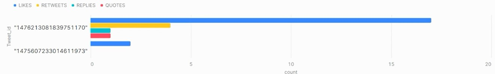

# Real-time-Twitter-dashboard-using-Snowflake-Microsoft-Azure
Real-Time Twitter dashboard for recent tweets using Snowflake &amp; Microsoft Azure

## Business Overview:

Delays in business operations and decision-making cause companies to lose out on opportunities and expose themselves to danger. Real-time data enables organizations to move faster since it highlights challenges and opportunities. Real-time data consists of information usable as soon as it is created, gathered, processed, and assessed in real time. 

To come up with such situations, I tried designing a project as a proof of concept to get a real-time dashboard available in Snowflake powered by Twitter, Azure blob storage, and Snowflake (Snowpipe). Twitter API served as a source of information for the project. I planned on pulling the number of tweets, retweets, likes, and counts from the recent tweets we get from the Twitter API. Azure blob storage and the Snowpipe feature from Snowflake were used to push this data from Twitter to the Snowflake dashboard.

Above shown is the snapshot of the Snowflake dashboad that shows there were two tweets extracted from the twitter API, with the  likes for each tweet between 0-20, retweets between 0-5, replies and quotes for both the tweets between 0 and 1. 

## Flow of the project:

### 1. Azure Setup:  

Azure Storage Basics: Whenever we want to look out for the cloud, the basic thing we look for is the storage structure of that particular cloud. We're using Azure Cloud Storage for our project, so the very basics types of storage in Azure Cloud are as follows:

  a. Azure Blobs - Used to store a chunk of data (text files, media files, etc.)  
  b. Azure Files - Used to store file systems (folders, shared files, etc.)  
  c. Azure Queues - Used to store orderly processed data  
  d. Azure Tables - Used to save data in the form of structure / NoSQL data. In the table storage, we can store any number of rows, and each row can have a different number of columns. So, there is no structure for rows and columns in azure table storage. It is based on the relationship between table name and their entities. There is no schema here for the structuring of the tables, hence NoSQL.  

  Advanced types of services are Azure SQL, Azure Cosmos DB, and many more. This segregation of advanced and basic storage is not specified by Microsoft. Advanced services come with a database structure. The same is not the case with basic storage types in Azure. 

  1.1 The very first step in the project is to create an Azure account - Free Trial (if possible), as it depends on the email id used for creating the account. The email might not be eligible for a free trial if it was already used. If a free trial is not possible, choose the "Pay as you go" Subscription, where the account will be billed based on the usage. I created a free version of the Azure account, with locally redundant files having HTTPs rest and transit encryption protocols.  
  1.2 Create a Resource Group and ensure to choose it for all the resources we create for this project.  
  1.3 Create a Storage Account. After creating the storage account, I created a container inside it. Now, we have written a python script to extract data from Twitter into a JSON format. That data will be stored in this container.  
  1.4 Create a Queue within that Storage Account. The queue will be used as a triggering mechanism. It will let us know that whenever a new file is landed, an event will be inserted in the queue. Lastly, we need to configure an event in the container so that the entry gets inserted into the queue. While creating an event, we give the event name, the schema is the default, the system topic name (name of the topic to which the event will be published) is given, and we select when we want to publish the event (for example blob created), and at the end, we specify the endpoint, i.e., the storage queue for us. So, whenever a blob is created in the container, an event will be triggered and will be published in the specified event name in the storage queue that we have created.   
  1.5 We need to assign roles to the storage and queue account using Access Control in Azure. This will be done once we run the Snowflake commands. We get the client ids for our storage account and queue while running the snowflake commands. This allows faster communication between Snowflake and Microsoft Azure as we sign on the consent URL generated in snowflake. Roles are assigned to the snowflakes service principles.  
  
  Role in IAM of Storage Account - Storage Blob Contributor permission  
  Role in IAM of Storage Queue - Storage Queue Contributor permission  
  
### 2. SnowFlake Setup:

  2.1 Go to the website: https://www.snowflake.com/login/  
  2.2 Click on the tab 'Start for free.'  
  2.3 Enter your details and press continue  
  2.4 Select a Standard version as we're doing this project as proof of concept.  
  2.5 Select the data storage service you want to use. I have selected Microsoft Azure because I'll be using Azure Blob Storage for data storage.  
  2.6 Select the region where you want your cloud storage to be located.  
  2.7 Click on the Get Started tab.  
  2.8 We get $400 worth of usage from Snowflakes Standard Edition for a 30-day free trial.  
  2.9 Once you get the activation mail on the email you provided, set your user id and password, and your Snowflake Standard account will be activated.  
  2.10 After login, you can see your Snowflake profile, where there will be one database already shared with you by Snowflake for POC. You can use the same or not, that depends on you.  
  2.11 There will be no warehouse in the Standard Edition. We need to add our own.  
  2.12 There are 5-6 different types of roles for the Snowflake account. Accountadmin, orgadmin, public, securityadmin, useradmin, and sysadmin. All of the roles have their own features. Accountadmin is the admin of all the roles in the snowflake account. Basically, it is the owner of the account. Orgadmin is the admin of multiple snowflake accounts, for example, the owner of multiple projects on multiple snowflake accounts. securityadmin is the one that grants roles and access to different users. useradmin is the one that creates new users. Lastly, the public role is open to all services given to people newly added to the snowflake account.  
  
  Once we're done with your Snowflake and Azure setup, you need to run the snowflake worksheet attached in the code to create storage and queue integrations within snowflake to connect with the Azure storage and queue. We get our Azure Consent URLs after running both of these integrations, and we can grant permission for Azure to Snowflake using the same. We also create our database, stage, snowpipe, and table to store data in snowflake in the same script.
  
### 3. Twitter Setup:

  3.1 We need to have a Twitter account, the basic one before we start the setup for our Twitter developer account  
  3.2 Go to twitter.developer.com  
  3.3 Sign in with the Twitter credentials  
  3.4 Do the initial setup - name, country, use-case  
  3.5 Accept the agreement  
  3.6 Done  
  3.7 Once the developer account is created, we need to create a project inside the twitter account. Copy the bearer token API keys after creating the project as it will be used in the twitter python script.  

### 4. End-to-end Flow of the project:

  4.1 Copy and paste the bearer token from the Twitter project and connection string from the Azure container in the python script to extract tweets in JSON format from Twitter API.  
  4.2 Run the python script on the command prompt of the local machine.  
  4.3 Once we get the results, check the Azure container. It should show some files with the latest data  
  4.4 If the data is present in Azure Container, then it should also be present in the Snowflake table that we have created in our Snowflake database, as all the configurations to connect Snowflake and Azure were already done.  
  4.5 Lastly, create a dashboard on the Snowflake and display the results as mentioned above in the image.  

# Thankyou so much for coming till the end of the file. Please let me know if you have any questions.

